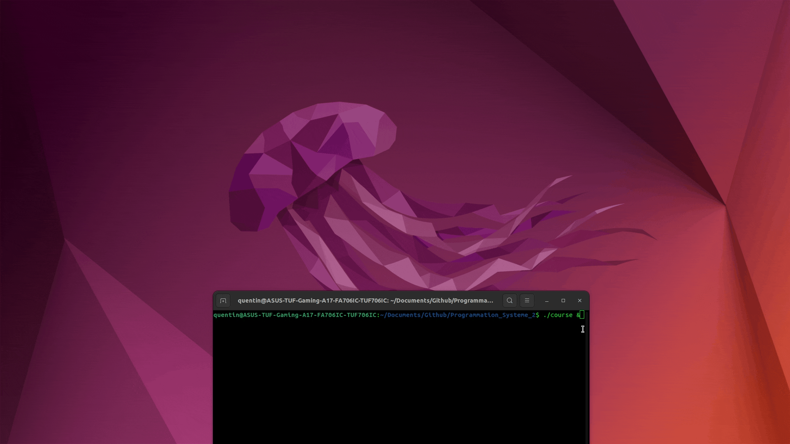
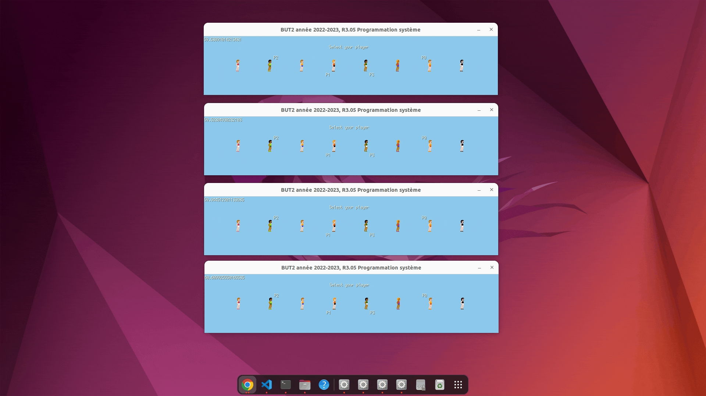

[](README.md) 

# Course en réseau

J'ai travaillé sur ce projet lors de ma deuxième année de BUT Informatique.
Le but de ce projet était de permettre à plusieurs clients de pouvoir jouer ensemble à travers le réseau. Le jeu est une simple course où il faut appuyez sur la touche espace pour faire avancer son coureur et le premier arrivé à la fin gagne. Le projet s'est découpé en deux parties :
- Une première qui consistait à avoir une version fonctionnelle du jeu, c'est à dire où 4 joueurs pouvaient jour ensemble à travers le réseau
    - Le serveur gère les connexions des clients, l'état du jeu réplique les actions de chaque client aux autres
    - Les clients jouent simplement et les informations sont envoyées au serveur pour être traitées et répliquées aux autres clients
- Une deuxième qui consitait à ajouter des améliorations au jeu :
    - Affichage du nombre de joueurs connectés
    - Voir la sélection des coureurs des autres joueurs
    - Deux joueurs ne peuvent pas choisir le même coureur
    - ...

Le projet a été réalisé en Go avec la librairie [Ebiten](https://ebitengine.org/) pour l'interface graphique.

Retrouvez plus d'informations sur le sujet [ici](Sujet.pdf)


# Installation et configuration

Pour faire fonctionner ce programme, il faut avoir installer [Go](https://go.dev/) sur sa machine.

Il faut tout d'abord cloner ce dépôt.

Puis, il faut changer la variable `serverIp` du fichier `game.go` pour indiquer à quelle adresse IP les clients doivent se connecter (ex: localhost)

Pour compilter le programme, exécuter :
```
go build
```

Pour lancer le serveur, exécuter :
```
go run serveur.go
```

Puis, pour connecter un client (à répéter 4 fois pour avoir 4 joueurs), exécuter :
```
./course
```


# Screenshots


*Connexion des clients*


*Sélection des coureurs*


*Course*


# Contact

Email: [quentin.chauvelon@gmail.com](mailto:quentin.chauvelon@gmail.com) 

LinkedIn: [Quentin Chauvelon](https://www.linkedin.com/in/quentin-chauvelon/) 