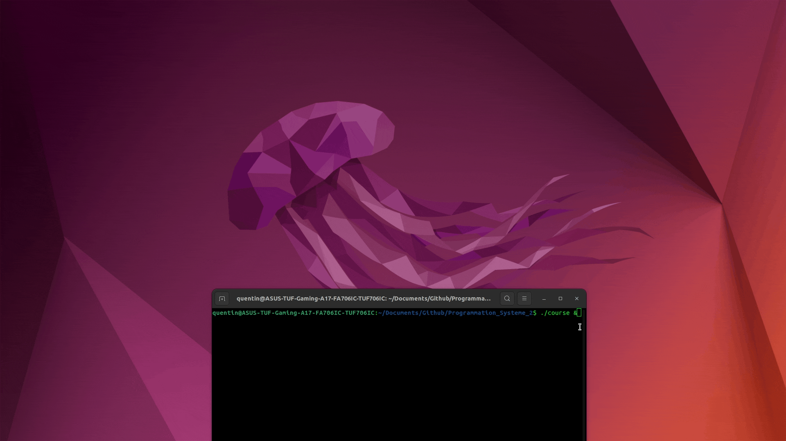
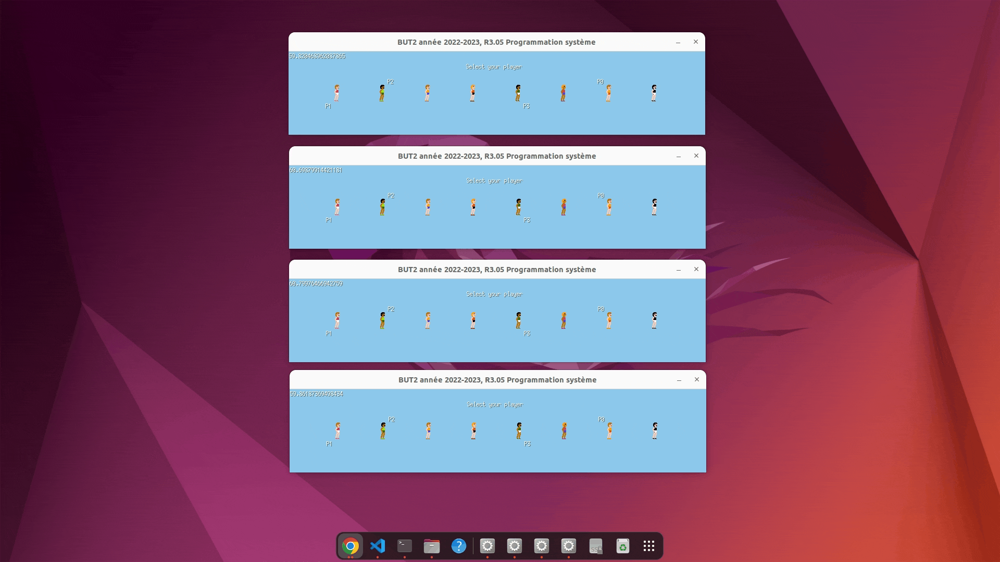

[](README.fr.md) 

# Network race

I worked on this project in my second year of BUT in Computer Science.
The goal of the project was to create a game that could be played by multiple clients over the same network. The game is a simple race where players have to press space to make their runner run, the first one to reach the finish wins. The project was divided in two parts:
- The first one involved creating a working version of the game, in which 4 players could play together over the same network
    - The server would manage the connections, game state and replicate actions from one client to the others
    - The clients would simply play and information are sent to the server to be processed and replicated to other clients
- The second one aimed at improving the game :
    - Displaying the number of connected players
    - See other players runner selection
    - Two players can't select the same runner
    - ...

The project was developed in Go with the [Ebiten](https://ebitengine.org/) library for the user interface.

Find out more about the project [here](Sujet.pdf).


# Installation and setup

In order for the program to work, you need [Go](https://go.dev/) installed on your machine.

First, clone this repository.

Then, you have to change the `sereverIp` variable in the `game.go` file so that clients know what IP address they should connect to (eg: localhost)

To compile the program, execute:
```
go build
```

To run the server, execute:
```
go run serveur.go
```

Next, to connect a client (repeat 4 times for 4 players), execute:
```
./course
```


# Screenshots


*Connexion des clients*


*Runner selection*


*Race*


# Contact

Email: [quentin.chauvelon@gmail.com](mailto:quentin.chauvelon@gmail.com) 

LinkedIn: [Quentin Chauvelon](https://www.linkedin.com/in/quentin-chauvelon/) 